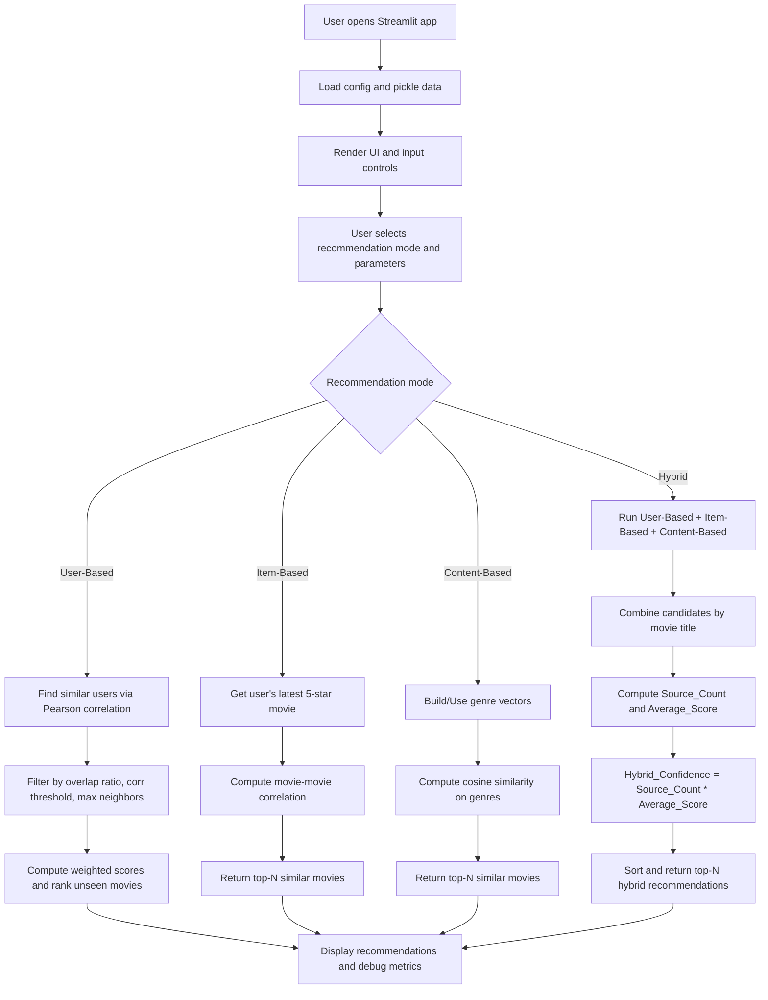

# Hybrid Recommender System

Streamlit-based movie recommendation application. Combines user-based, item-based, and content-based approaches into a hybrid system.

## Quick Start

```bash
# Install
pip install -r requirements.txt

# Run
streamlit run app.py

# Docker
docker-compose up
```

Application: `http://localhost:8080`

## Project Structure

```
├── app.py                 # Streamlit UI
├── config.py              # Configuration
├── utils.py               # Utilities
├── error_handling.py      # Error handling
├── logging_config.py      # Logging
├── security_utils.py      # Security
├── performance_utils.py   # Performance
├── data_loader/           # Data loading
├── recommenders/          # Algorithms
├── ui/                    # UI components
└── tests/                 # Tests (115 tests, 70% coverage)
```

## Application Flow Diagram



## Development

```bash
# Format & lint
make format
make lint

# Tests
make test              # Unit tests
make test-integration  # Integration tests
make test-all          # All tests
make test-cov          # With coverage

# Pre-commit
make setup-precommit
```

## Configuration

Environment variables:
- `PICKLE_PATH` - Data file path
- `LOG_LEVEL` - DEBUG|INFO|WARNING|ERROR
- `SERVER_PORT` - Default: 8080

## Testing

115 tests, 70% coverage:
- 84 unit tests
- 16 integration tests
- 15 utility/UI tests

## Deployment

```bash
# Docker
docker-compose up --build

# View logs
docker-compose logs -f
```

Prebuilt image deployment (GHCR):

```bash
docker compose -f docker-compose.ghcr.yml pull
docker compose -f docker-compose.ghcr.yml up -d
```

## Tech Stack

- Python 3.11
- Streamlit 1.50.0
- Pandas, NumPy, Scikit-learn
- pytest (testing)
- Docker (deployment)
